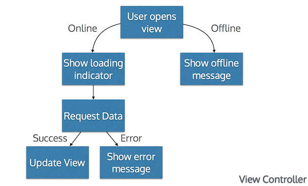

Brian's 360|iDev 2014 Notes
===========================

Before reading further, you should really download [Flippy Unicorn](https://itunes.apple.com/us/app/flippy-unicorn/id839557990?mt=8).  You could not to buy the game, but do you 
really want to live in a world where you don’t flip unicorns?

*This is not a sponsored advertisement in any way.  It's just an app where you
flip a unicorn drawn by a kid.  What's not to love?*

The Big TL;DR
=============

There were lots of good talks at 360|iDev.  These are the notes I took on ones
that will be directly influencing my development.  Probably the most notable are:

- **Effective Cycript**, outlining a ObjC/JS hybrid grammar debugger that can attach to processes and run code without halting the main thread.
- **Offline is not a special case**, outlining a strategy for caching, displaying, and synchronizing data that simplifies view controller logic and error handling.
- **Stupid Auto Layout tricks**, covering a variety of ways to make AutoLayout debugging easier.
- **The App Store Isn't Broken: You're not selling software anymore**, reflecting on what a successful app actually is and how to get there.  *Hint: It isn't being #1 in the app store.*

Day 1
=====

Adaptive Layout Workshop
------------------------

> **TL;DR** iOS8 Adaptive Layout is like a really, really simplified version of
> Responsive Design.  You can use Interface Builder to define constraints, font,
> assets and views that should be active for different size classes.
> Turning on and off constraints is also better in iOS8.  Orientation change has
> been abstracted into size change transitions.

    git clone https://github.com/sammyd/adaptive-layout-workshop.git

iOS 8 Adaptive Layout allows you to configure certain UI properties for certain size classes:

**Existing Size Classes**

| Device | Orientation | Vertical | Horizontal |
|--------|-------------|----------|------------|
| iPad   | Landscape   | Regular  | Regular    |
| iPad   | Portrait    | Regular  | Regular    |
| iPhone | Landscape   | Compact  | Compact    |
| iPhone | Portrait    | Regular  | Compact    |

Unlike in previous versions of iOS, constraints don't need to be added or removed to affect their behavior.  Instead they are activated or deactivated.

In Interface Builder, you would define all of your standard constraints in Any/Any, then:

1. Switch to the size class you want to customize.
2. Select a constraint you want to remove.
3. Hit delete.
4. Add new constraints to finish constraining the UI.

Hitting delete in anything but Any/Any is a shortcut for selecting the constraint, clicking the "+" symbol next to Installed, selecting the current size class, and unchecking Installed next to the size class that was registered.

Similarly, adding a constraint while not in Any/Any has the effect of adding it just for that size class. Any/Any will not have Installed checked.

It is possible to enable and disable constraints at runtime with the following methods:

    /* The receiver may be activated or deactivated by manipulating this property.  Only active constraints affect the calculated layout.  Attempting to activate a constraint whose items have no common ancestor will cause an exception to be thrown.  Defaults to NO for newly created constraints. */
    @property (getter=isActive) BOOL active NS_AVAILABLE(10_10, 8_0);

    /* Convenience method that activates each constraint in the contained array, in the same manner as setting active=YES. This is often more efficient than activating each constraint individually. */
    + (void)activateConstraints:(NSArray *)constraints NS_AVAILABLE(10_10, 8_0);

    /* Convenience method that deactivates each constraint in the contained array, in the same manner as setting active=NO. This is often more efficient than deactivating each constraint individually. */
    + (void)deactivateConstraints:(NSArray *)constraints NS_AVAILABLE(10_10, 8_0);

---

Since iPad has the same size class for portrait and landscape, we worked though ane example with the iOS 8 method that replaces orientation change notification:

    @IBOutlet var wideLayoutConstraints: [NSLayoutConstraint]!
    @IBOutlet var tallLayoutConstraints: [NSLayoutConstraint]!

    override func viewWillTransitionToSize(size: CGSize, withTransitionCoordinator coordinator: UIViewControllerTransitionCoordinator!) {
      super.viewWillTransitionToSize(size, withTransitionCoordinator: coordinator)

      coordinator.animateAlongsideTransition({ (context) -> Void in
        self.setupConstraintsForSize(size)
      }, completion: { (context) -> Void in
      })
    }

    override func viewDidLoad() {
      super.viewDidLoad()
      self.setupConstraintsForSize(view.bounds.size)
    }

    func setupConstraintsForSize(size: CGSize) {
      view.layoutIfNeeded()
      if size.width > size.height {
        NSLayoutConstraint.deactivateConstraints(self.tallLayoutConstraints)
        NSLayoutConstraint.activateConstraints(self.wideLayoutConstraints)
      } else {
        NSLayoutConstraint.deactivateConstraints(self.wideLayoutConstraints)
        NSLayoutConstraint.activateConstraints(self.tallLayoutConstraints)
      }
    }

In the above code, and by assigning the same disabled constraints to the outlet collections, we were able to achieve the same orientation change behavior as the iPhone has.  The size transition code can also be used for configuring properties beyond layout.  There is no notification for flipping a device over like there is in iOS7.

---

In addition to enabling/disabling constraints, Adaptive Layout lets you set a few other properties:

- Views have an Installed checkbox which apparently affects visibility since constraints are still preserved.
- Label fonts can be specified for for size classes.
- Inside individual constraints, different constants can be specified.
- Inside asset catalogs, images variants can be specified for different size classes.

POP Workshop
------------

### POP

> **TL;DR**
> - Tweak makes it easy for developers (or designers) to adjust values in an
>   app without rebuilding.
> - POP is a simpler way to add springiness to an animation.
> - POP is also a powerful (but potentially expensive) way of animating
>   properties that were not traditionally available with CoreAnimation (e.g.,
    color hue).
> - Xcode 6 introduces live-rendering of custom views and native UI for custom
>   properties via annotations.

    git clone https://github.com/sammyd/pop-workshop.git

### Tweak

The Tweak framework makes it really easy to experiment with animation properties:

    zoomAnimation.springBounciness = FBTweakValue(@"BouncyButton", @"Restore Zoom", @"Bounciness", 15.0, 0.0, 30.0);

Shake the phone and **BAM!** a fully adjustable animation property without rebuilding the app.  You can give the app to someone, they can adjust 'til they're happy and then export the values and send them back.

POP is an animation library that works within CoreAnimation but outside of the CAAnimation animation stack.

**Different animation stacks**

- **CAAnimation** defines short-lived animations on the presentation layer stack without actually affecting the actual layers.  Start and end values are defined along with animation properties.  When the animation is removed, the layer's presentation reverts to whatever is in the hierarchy.
- **UIKit Animation** updates properties of views and layers and sets up CABasicAnimations from the previous view properties to the new view properties.  When interrupted, views will update to their final state.  Much of the power of CAAnimation is abstracted out for simplicity.
- **POP** defines short-lived animations on actual view/layer/other properties which are then reflected in the presentation layers.  For thread-unsafe properties of UIViews, this means animating in the main thread.  Because some properties can cause views to re-layout, these animations could become choppy if misused.  One advantage is that animations can be stopped or changed at any point.

POP's animation engine is actually very similar to what UIScrollView does, performing an update on the main thread at each display update until the animation completes in order to take advantage of the side effects of scrolling (like being able to reuse tableview cells).

---

POP provides a variety of built-in animations for UIView and CALayer properties and includes a spring animator.

    POPSpringAnimation *zoomAnimation = [POPSpringAnimation animationWithPropertyNamed:kPOPLayerScaleXY];
    zoomAnimation.toValue = [NSValue valueWithCGPoint:CGPointMake(1.0, 1.0)];
    zoomAnimation.velocity = [NSValue valueWithCGPoint:CGPointMake(-10, -10)];
    zoomAnimation.springBounciness = 15;
    [self.layer pop_addAnimation:zoomAnimation forKey:@"restoreAnimation"];

That said, pop category methods are actually on `NSObject` and animations can be defined on any property that can be expressed as a `CGFloat[]`.

    POPAnimatableProperty *mappedColorProperty = [POPAnimatableProperty propertyWithName:@"com.poptastic.dangerindicator.mappedcolor"
       initializer:^(POPMutableAnimatableProperty *prop) {

         // Read Value
         prop.readBlock = ^(CAShapeLayer *layer, CGFloat values[]) {
           values[0] = [[layer valueForKey:@"dangerLevel"] floatValue];
         };

         // Write Value
         prop.writeBlock = ^(CAShapeLayer *layer, const CGFloat values[]) {
           [layer setValue:@(values[0]) forKey:@"dangerLevel"];
           layer.fillColor = [UIColor colorForNormalisedValue:values[0]].CGColor;
         };

         // Threshold
         prop.threshold = 0.01;
    }];

    POPBasicAnimation *colorAnimation = [POPBasicAnimation animation];
    colorAnimation.duration = 0.4;
    colorAnimation.property = mappedColorProperty;
    colorAnimation.toValue = @(value);
    [self.innerCircle pop_addAnimation:colorAnimation forKey:@"colorAnimation"];

### Interface Builder in Xcode 6

Xcode 6 makes custom views in InterfaceBuilder suck a lot less.

If you mark your class as designable:

    IB_DESIGNABLE
    @interface PTCDangerIndicator : UIView

Xcode will build that class and use it to render the custom class in Interface Builder.

It will also look for properties annotated as inspectable:

    @property (nonatomic, assign) IBInspectable CGFloat value;

The final result:

Day 2
=====

Stupid Auto Layout tricks
-------------------------

> **TL;DR** A variety of tricks for inspecting autolayout.  Categories have been added to SE debug builds.

- Podcast: http://cocoaradio.fm
- Book: http://autolayoutzen.com
- Previous talk: Achieving Zen with Auto Layout

### Paint by memory address

1. `po self.view.subviews`
2. Find memory address.
3. `expr [((UIView *)ADDRESS) setBackgroundColor:[UIColor red]]`
4. `c` (continue)

### Interface Builder Tricks

In Xcode, set labels on constraints you really care about.  This makes it easier to find them and helps validate what you're dragging to outlets.

### `_autolayoutTrace`

    po [self.view _autolayoutTrace]

Prints a lighter version of recursive description, flags views with ambiguous constraints.

In iOS 8 DEBUG builds, you can set `view._layoutDebuggingIdentifier` to provide a better view name.

### Restoration Identifiers

Prior to iOS 8, you can improve Auto Layout logging by providing a restoration identifier:

1. Clobber or swizzle `-[UIView nsli_description]` and `-[UIView nsli_descriptionIncludesPointer]` to use `restorationIdentifier` if available.

        @implementation UIView (SGAutoLayoutExtensions)

        #ifdef DEBUG

        - (NSString *)nsli_description {
            return [self restorationIdentifier] ?: [NSString stringWithFormat:@"%@:%p", [self
        class], self];
        }

        - (BOOL)nsli_descriptionIncludesPointer {
            return [self restorationIdentifier] == nil;
        }

        #endif

        @end

2. Define restoration identifiers in IB.

When you run into a overconstrained exception breakpoint, the app will use these keys for

### QuickLook

Add `debugQuickLookObject` on NSLayoutConstraint.

    NS_INLINE NSString *NSStringFromLayoutAttribute(NSLayoutAttribute attribute) {

        switch (attribute) {
            case NSLayoutAttributeTop:
                return @"top";
            case NSLayoutAttributeLeft:
                return @"left";
            case NSLayoutAttributeRight:
                return @"right";
            case NSLayoutAttributeWidth:
                return @"width";
            case NSLayoutAttributeBottom:
                return @"bottom";
            case NSLayoutAttributeHeight:
                return @"height";
            case NSLayoutAttributeCenterX:
                return @"center.x";
            case NSLayoutAttributeCenterY:
                return @"center.y";
            case NSLayoutAttributeLeading:
                return @"leading";
            case NSLayoutAttributeBaseline:
                return @"baseline";
            case NSLayoutAttributeTrailing:
                return @"trailing";
            case NSLayoutAttributeNotAnAttribute:
                return nil;
        }
        return [NSString stringWithFormat:@"%ld", (long)attribute];
    }

    NS_INLINE NSString *NSStringFromLayoutRelation(NSLayoutRelation relation) {

        switch (relation) {
            case NSLayoutRelationEqual:
                return @"==";
            case NSLayoutRelationLessThanOrEqual:
                return @"<=";
            case NSLayoutRelationGreaterThanOrEqual:
                return @">=";
        }

        return [NSString stringWithFormat:@"? (%ld)", (long)relation];

    }

    @implementation NSLayoutConstraint (AutolayoutDebugging)

    - (id)debugQuickLookObject
    {
        NSMutableString *string = [NSMutableString string];

        [string appendFormat:@"[%@].%@ %@", ([self.secondItem respondsToSelector:@selector(superview)] && [self.secondItem superview] == self.firstItem) ? @"super" : [self.firstItem nsli_description], NSStringFromLayoutAttribute(self.firstAttribute), NSStringFromLayoutRelation(self.relation)];

        if (self.secondItem && self.secondAttribute != NSLayoutAttributeNotAnAttribute) {
            [string appendFormat:@" %f ✕ [%@].%@", self.multiplier, ([self.firstItem respondsToSelector:@selector(superview)] && [self.firstItem superview] == self.secondItem) ? @"super" : [self.secondItem nsli_description], NSStringFromLayoutAttribute(self.secondAttribute)];
        }

        if (self.constant < 0) {
            [string appendFormat:@" - %f \n\n", fabsf(self.constant)];
        } else {
            [string appendFormat:@" + %f \n\n", self.constant];
        }

        [string appendFormat:@"firstItem: %@\n", self.firstItem];
        [string appendFormat:@"secondItem: %@\n\n", self.secondItem];
        [string appendFormat:@"ASCII Art: %@", self.asciiArtDescription];

        return [string copy];
    }

    @end

### Instruments

Cocoa Layout instruments, simulator only, logs every constraint event.  In Xcode 6 this is currently buggy and needs to be manually added.

Advanced Core Data, Much Wow
----------------------------

> **TL;DR** CoreData is complex.  Here's an approach.

[Slides](https://speakerdeck.com/astralbodies/advanced-core-data)
[Code](https://github.com/astralbodies/CoreDataConcurrencyDemo)

### Threading

CoreData on the main thread is fine, until it's not:
 - App stutters
 - Async operations
 - Batch processing

Theading has challenges:
- NSManagedObjects belong to a single context/thread.  No sharing.
- Can be passed around by NSManagedObjectID.
- managedObject.objectID.isTemporaryID

Thread containment is OVER.

### Queues are the future

Contexts are created with concurrency type and parent context.  Workers will have private queue concurrency.

You will need to use NSMangedContextDidSaveNotification for a few things.

Updates are done with `performBlock:` and `performBlockAndWait:`.

### Preferred Setup

- Master context is in the background, only exposed to main context.
- Main context is on main queue.
- Short-lived worker contexts are spawned in background queues.
- Supports asynchronous saves.

[This may not actually be the best setup.](http://floriankugler.com/blog/2013/4/29/concurrent-core-data-stack-performance-shootout)

### Saving/Merging/Conflicts

Save only in one spot.  Pick the merge policy that is right for your app:
- `NSErrorMergePolicy`: Merge errors are not handled.  Conflicts are given back to the developer.
- `NSMergeByPropertyStoreTrumpMergePolicy`: What is in SQL wins.
- `NSMergeByPropertyObjectTrumpMergePolicy`: What's in memory wins.
- `NSOverwriteMergePolicy`: Just replace what's there.

`NSErrorMergePolicy` provides a list of conflicts to be resolved in the error.  Probably needs user resolution.  Good luck with that UX.

### Background fetching

- Done with persistent store coordinator.
- Can warm the cache with `request.resultType = NSManagedObjectIDResultType`

### Migration

- Automatic infers a mapping model, migrates automatically.

#### Lightweight

- SQLite does all the work without loading objects into memory.
- Fast
- Light on memory

#### Heavyweight

- Every object loaded into memory.
- Manually map and manipulate data.

#### Infer mapping model

`NSInferMappingModelAutomaticallyOption`

- Goes from current store model to current app model, skipping intermediate versions.
- Things can get lost if the map isn't clear.
- Limited to:
    - Adding and removing attributes
    - Non-optional to optional
    - Optional becomes non-optional with default.
    - Renaming entity or property.

### Manual mapping model

- Mapping is from specific version to specific version
- Multiple version change not supported except through sequential migrations, which you have to code for.

**Migrations should be tested like crazy.  Can be unit tested.**

Offline is not a special case
-----------------------------

> **TL;DR** Using cache and moving API calls, data management outside of view controllers can improve UX, simplify design, make your app more resilient.

[**Slides**](http://float.ly/360idan)

Communication with servers fail all the time for many reasons:

- No connection
- Connected without Internet (happened a lot at the conference)
- Crowded connection
- Slow connection
- Changing networks  

For most apps, offline is not a special case.  Exceptions are when stale data is harmful or actions require immediate validation.

> **Aside:** Things like voting should happen in realtime because we have context critical error messages. Should something like favoriting a question ever show an error message?

### A common app design

Most apps have a flow where you open a view controller, load the content, then update or show an error message:

This has a few problems:

- View controller is responsible for managing data freshness.  If you pop and then push again, do you load the content again?  The view controller shouldn't really be making that choice.
- Error messages may get in the way.
- It's inefficient.  If you're loading content every time the view controller appears is it too often? How often does the data update?
- User experience is out of our control, based on network conditions.

Trying to fix these problems make your app logic a lot messier:

### A better approach

- Cut down on wasteful communications.
- Build views with local data.
- Don't display error messages for things that are not the user's fault.
- Retrieve data in a timely manner.

### Caching

Cache incoming server data immediately, prepare and parse it in the background.

Benefits:

- Views with cached data can be built quickly.
- Logic flow doesn't change based on the connected state of device.
- Since you already have data you can make a smarter choice about whether and what additional data you need:
   - At a predefined interval,
   - When coming to the foreground,
   - In response to push,
   - When user requests new data.

### Keeping views fresh

- Send notification when new data is available: `SEDataStoreQuestionLoadedNotification`
- If the model is in memory, update it and let KVO notify of changes.
- **Don't interrupt the user by moving content, especially interactive content.**

### Sending data to the server

For requests that don't need an immediate response:

- Update local models immediately, assuming that a failed update will give us the data we need to revert the model.
- Synchronize when you can.
- Synching is hard, keep it as simple as you can get away with.

Presentation goes over some strategies for doing delayed synching.  Most important thing is that you need to be able to:
- Keep track of what changes have been successful.
- Manage dependent updates.
- Persist pending changes across launches. (NSURLRequest conforms to NSCoding.)
- Have a plan for what happens when a sync fails or succeeds.
- Manage conflicts, with something like an entity tag. (Timestamps suck.)

Effective Cycript
-----------------

> **TL;DR**
>
>     sudo ./cycript -p SpringBoard
>     cy# choose(SBIcon).filter(function (x) {return x.nodeIdentifier.indexOf('safari') != -1})[0].badge = "Woot!"
>
> 

http://www.cycript.org

Cycript is a debugger that can attach to Objective-C processes and execute commands without breakpoints.  It has a JavaScript grammar that lets you use Objective-C formatting for message passing.

Many standard C functions are available like `malloc` and `free`.  Other functions can be accessed through `dlsym` and a typecast syntax based on `@encode`:

    cy# fopen = @encode(void *(char *, char *)) dlsym(RTLD_DEFAULT, "fopen")

Cycript is more verbose than Objective-C++.  You can pretty much just copy your code over and delete unnecessary stuff.

It supports both JavaScript and Obj-C strings, arrays, dictionaries.

    cy# @[] instanceof Array
    true

    cy# @[5, 6, 7, 8].slice(1, 2) // JS method on Objective-C class
    [@6] // JS Array with ObjC number. Not sure how that happened.

**Grammar assisted tab completion.**  Runs through the grammar to the tab, runs the successfully parsed code so far and looks up off of that.  **YOUR CODE ACTUALLY RUNS WHEN YOU HIT TAB! BE CAREFUL!!!**

Output is designed to be copied and run.

Supports Obj-C block.  More verbose syntax because type of parameter blocks is not exposed to the runtime.

    cy# ^void (int a) { system.print(a) }

Can create new classes and categories:

    cy# @implementation Thing : NSObject { int t; } - (id) hello { return {m:5}; } @end
    cy# [[new Thing init] hello]

    cy# @implementation Thing (ext) - (id) foo { return 5; } @end

Can attach to processes by name or PID:

    sudo ./cycript -p Finder
    sudo ./cycript -p SpringBoard

Can add Javascript methods to Objective-C classes.

    cy# UIApp.constructor
    Springboard
    cy# UIApp.constructor.prototype.foo = function() { return 5; }
    cy# UIApp.foo()
    5

Can swizzle method implementions with JavaScript:

    cy# SBIconView.messages['setIsEditing:animated:'] = function(editing, animated) { [this setAlpha:(editing ? 0.5 : 1)]; }

`choose(SBIconView)` searches the heap for instances of class

Cycript pod lets you run cycript in your app through the remote debugger.

    pod repo add saurik git/git.saurik.com/podspecs.git

Day 4
=====

Dynamics
--------

> **TL;DR** Overview of dynamic animators, a basic physics engine for UIKit.

[Slides](http://www.slideshare.net/andriajensen/ui-kit-dynamics360idev2014)

- `UIDynamicBehaviorAnimator`, which must be retained, defines rect over which rules will apply and manages animations.

- `UIDynamicBehavior` subclasses provide basic physics rules which can be composited.

- Rules can be applied to `UIView`, `UICollectionViewLayoutAttributes`, anything that conforms to this protocol:

        @protocol UIDynamicItem <NSObject>

        @property (nonatomic, readwrite) CGPoint center;
        @property (nonatomic, readonly) CGRect bounds;
        @property (nonatomic, readwrite) CGAffineTransform transform;

        @end

    (CALayer cannot conform because `transform` is a 3D transform vs the 2D here).

### Behaviors

- `UISnapBehavior`

    - snap to a point, adjustable dampening

- `UIGravityBehavior`

    - Only affects views when on.
    - X and y directions

- `UIPushBehavior`

    - instant or continuous
    - Adjust magnitude/angle or direction
    - UIKit Newton = 100x100 view at 100pt/s²
    - View continues to drift after complete.

- `UIAttachmentBehavior`

    - Attach to item or point on screen.
    - length, frequency, dampening
    - Can attach to any point inside view
    - only two items per attachment
    - attachment can be used to anchor a point to a gesture recognizer

- `UICollisionBehavior`

    - Holds any number of items, lines, curves, reference bounds
    - Can add and remove items.
    - Affects rotation.

The App Store Isn't Broken: You're not selling software anymore
===============================================================

> **TL;DR** While discovery through the App Store sucks, it still has never
> been easier to distribute software.  You should focus on making an experience
> that people love and build your web presence.

[Slides](http://www.slideshare.net/apptentive/the-app-store-isnt-broken-youre-not-selling-software-anymore)

*The presentation started with a history of software distribution, highlighting
how much it sucked in the past, how shareware improved things a lot, and how we
don't want to spend money on something when we aren't sure if we'll even use
it.*

The common theme in the history of software distribution is reducing friction,
making it easy for users to get your app in their hands.

### Problem: Lists are distracting

- The top of the App Store is a stupid goal.  It is either a shortlived victory
  (winning the lottery) or a just a natural consequence of having a huge consumer
  product (Facebook, Pandora, Netflix...).

- Just having lots of downloads isn't good if people don't actually use your app
  once they've downloaded it.

- Getting featured can actually be poisonous for your app.  It puts your app in
  front of people who aren't your target audience so there's:

    - no long-term increase in your active users,
    - a lot of noise in your reviews (lower rating, weird requests),
    - an unreasonable expectation of how popular your app could be if you just
      made things work for those truly uninterested users.

**What you really care about is retention.**

### Reality: We're in the media business, not the software business.

You need to create experiences that people will love.  This will increase the
number of *active* users.  This is what makes it possible to earn revenue from
your app.

**Someone actively using and loving your app is the best marketing.**

    Download ⇒ Use ⇒ Repeat Use ⇒ Sharing, Bragging, Evangelizing ⇒ Discovery ⇒ Download

### You need to know what users think (meta!!!)

- Why do people use your app?
- What's special about it?
- How did users discover you? What were they trying to find?
- What do your users want to accomplish?
- What can you do to make their lives better?

### Guiding principles

- Make it easy to listen and respond (meta!!!)
- Design for feedback and communication
- Emphasize relationships
- Earn and cultivate love
